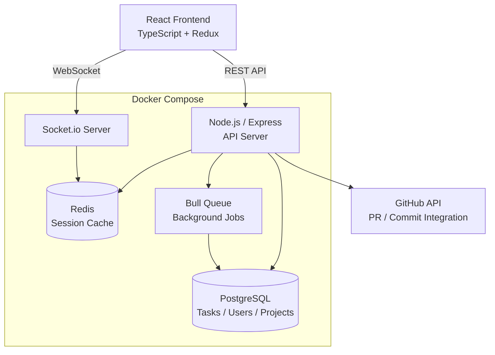

# 📋 TaskFlow

**Real-Time Project Management Platform**

     

A full stack SaaS project management platform built for distributed engineering teams. Think Jira meets Linear — fast, opinionated, and built with developer workflows in mind.

---

## 📋 Overview

**The Problem:** Existing project management tools are either too bloated (Jira) or too simple for engineering teams managing complex sprints, dependencies, and release cycles.

**The Solution:** A purpose-built platform that:
- Delivers real-time collaboration with zero-latency task updates
- Integrates natively with GitHub for automated PR → task linking
- Provides sprint analytics and velocity tracking out of the box
- Runs fast — sub-100ms API responses at scale

---

## 📊 Performance Metrics

| Metric | Result |
|--------|--------|
| API Response Time (p99) | < 95ms |
| WebSocket Latency | < 20ms |
| Daily Active Users | 15,000+ |
| Uptime | 99.94% |

---

## 🎯 Key Features

| Feature | Description |
|--------|-------------|
| **Real-Time Collaboration** | Live task updates via WebSocket — no refresh needed |
| **GitHub Integration** | PRs, commits, and branches auto-linked to tasks |
| **Sprint Management** | Full scrum workflow with burndown charts and velocity tracking |
| **Role-Based Access** | Granular permissions for admins, developers, and viewers |
| **Activity Feed** | Full audit log of all project activity |

---

## 🏗️ Architecture



---

## 📁 Project Structure

```
taskflow/
├── client/                  # React frontend
│   ├── src/
│   │   ├── components/      # UI components
│   │   ├── pages/           # Route-level pages
│   │   ├── store/           # Redux state management
│   │   ├── hooks/           # Custom React hooks
│   │   ├── api/             # API client (Axios)
│   │   └── sockets/         # Socket.io client handlers
│   └── package.json
├── server/                  # Node.js backend
│   ├── src/
│   │   ├── routes/          # Express route handlers
│   │   ├── sockets/         # Socket.io event handlers
│   │   ├── models/          # Database models
│   │   ├── middleware/      # Auth, logging, rate limiting
│   │   ├── jobs/            # Bull queue background jobs
│   │   └── integrations/    # GitHub API integration
│   └── package.json
├── docker-compose.yml
├── .env.example
└── README.md
```

---

## 🚀 Getting Started

### Prerequisites

- Node.js 20+
- Docker and Docker Compose
- PostgreSQL 16+ (or use Docker Compose)
- Redis 7+ (or use Docker Compose)

### Installation

```bash
git clone https://github.com/brian-codington/taskflow.git
cd taskflow
cp .env.example .env
```

### Run with Docker Compose (recommended)

```bash
docker-compose up --build
# Frontend: http://localhost:3000
# API:      http://localhost:4000
```

### Run locally

```bash
# Install dependencies
cd client && npm install
cd ../server && npm install

# Run database migrations
cd server && npm run migrate

# Start both servers
npm run dev  # from root (uses concurrently)
```

---

## 🔌 API Endpoints

| Method | Endpoint | Description |
|--------|----------|-------------|
| `POST` | `/api/auth/login` | Authenticate user |
| `GET` | `/api/projects` | List user's projects |
| `POST` | `/api/projects` | Create a project |
| `GET` | `/api/projects/:id/tasks` | List tasks for a project |
| `POST` | `/api/projects/:id/tasks` | Create a task |
| `PATCH` | `/api/tasks/:id` | Update a task |
| `GET` | `/api/projects/:id/sprints` | List sprints |
| `GET` | `/api/projects/:id/activity` | Get activity feed |

---

## ⚠️ License

MIT License — see [LICENSE](./LICENSE) for details.

---

*Part of [Brian Codington's Portfolio](https://github.com/brian-codington/brian-codington-portfolio)*
